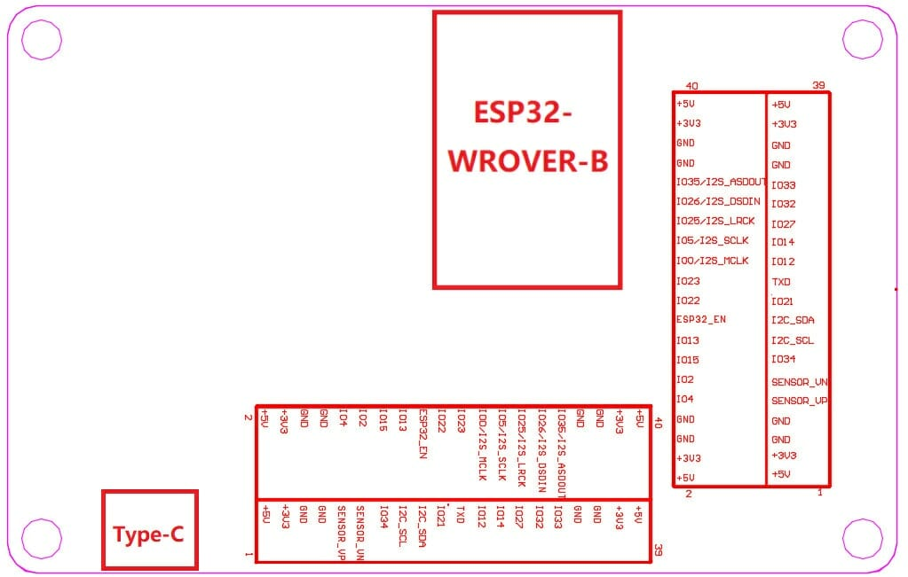

# ESP32 Display Project with an external Feasycom Bluetooth module
<<<<<<< HEAD
=======

- Board : WT32-SC01 from Wireless Tag
- Graphics Driver: TFT_eSPI by bdomer
- Framework: Arduino for ESP32

## WT32-SC01 Specs  
#### Pros:  
- ESP32 WROVER-B
- 3.5" 480x320 ST7796S TFT Display
- Capacitive touchscreen FT6336U
- Default 4MB Flash & 8MB PSRAM
- Two external expansion female pin headers with same pin-out (mirrored)
- 2 x 3.3v LDO, 1 for the board and 1 for the external expansion

## Board config
- TFT (ST7796)
    - TFT_RST=22
    - TFT_SCLK=14
    - TFT_DC=21
    - TFT_CS=15
    - TFT_MOSI=13
    - TFT_MISO=12
    - TFT_BCKL=23
- Touch	(FT6336U)
    - TOUCH_SDA=18
    - TOUCH_SCL=19
    - I2C_TOUCH_ADDRESS=0x38
- Digital Pins
    - Bluetooth=33
    - Nebelmaschiene=4
    - Movingheads=32
    - LED=27
- UART Pins
    - UART_TX=26
    - UART_RX=25

>>>>>>> fa60744ff9cd71c68828ca7156991c93d8509702

